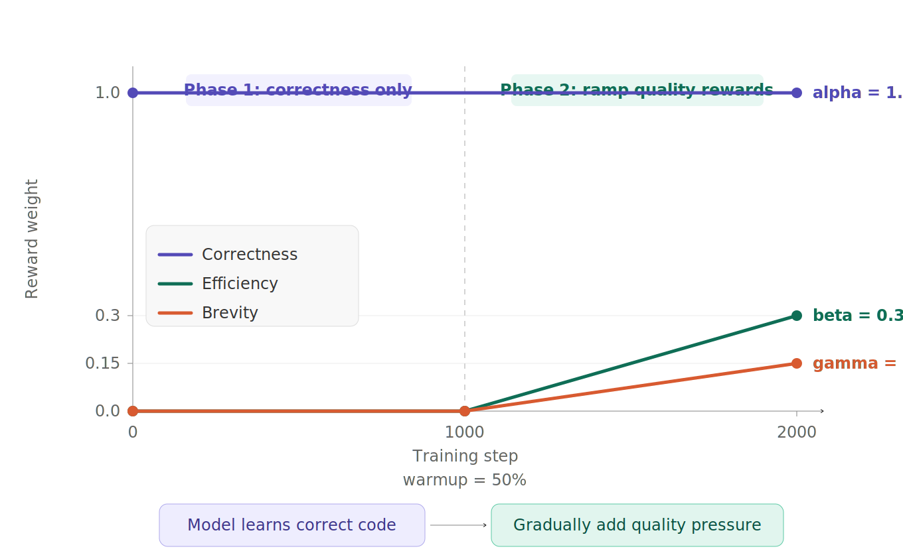
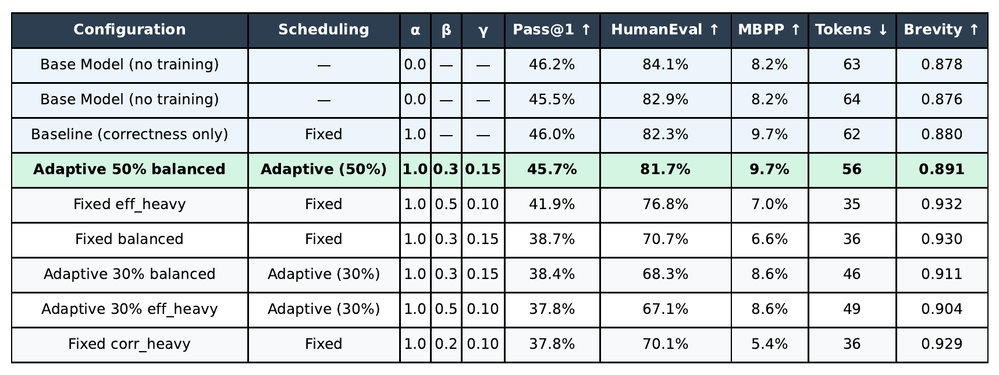
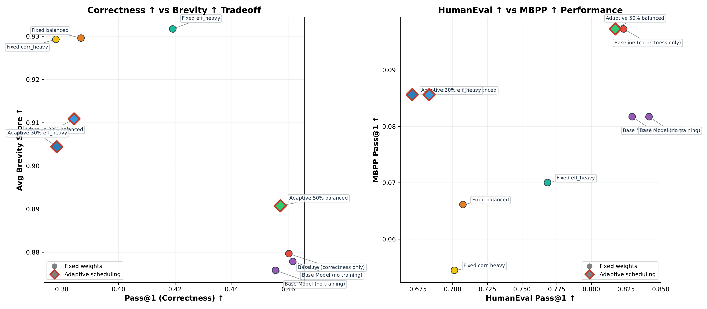
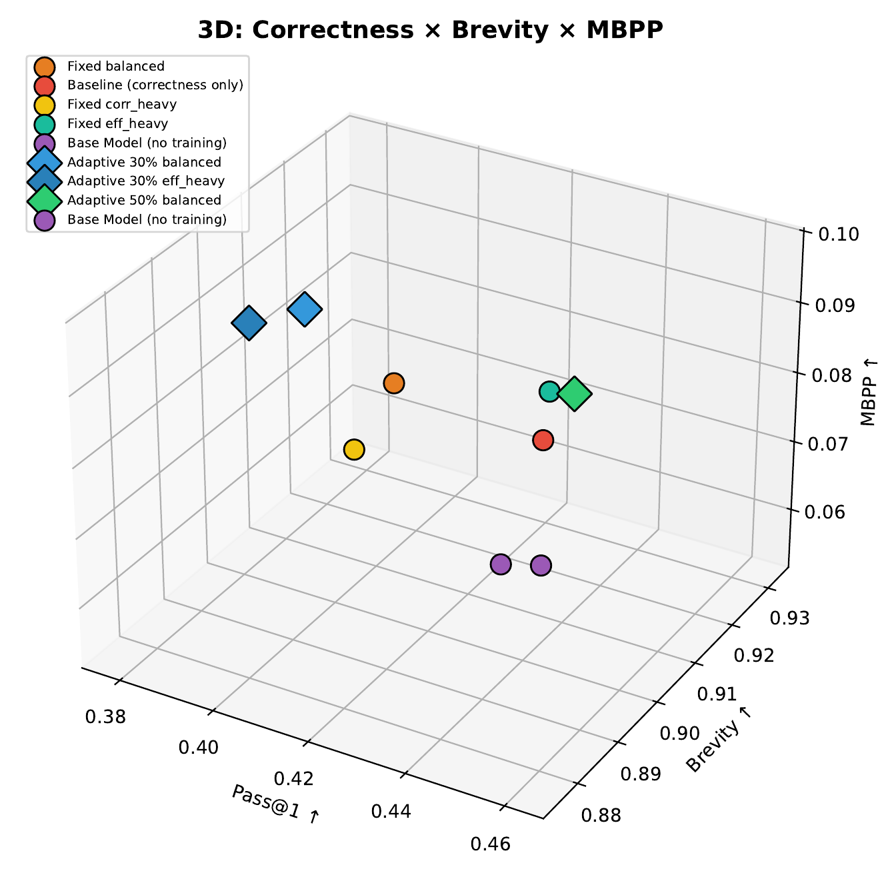
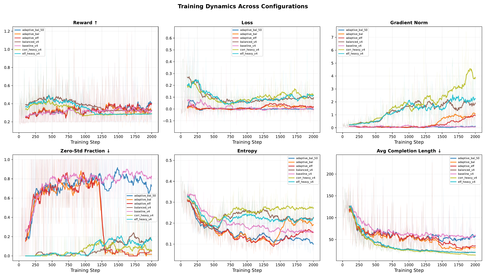
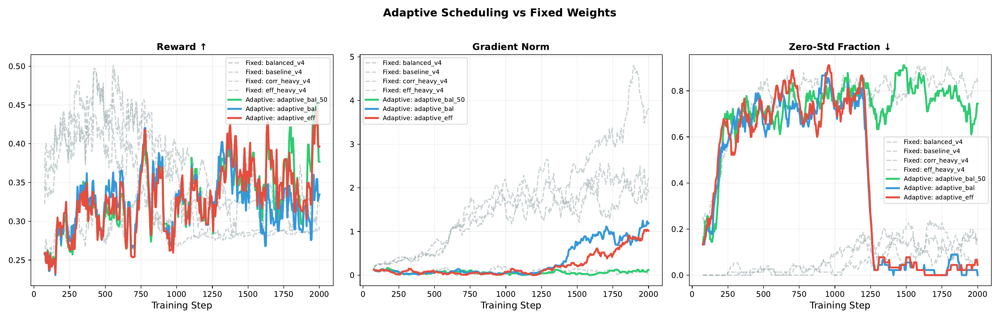

# Adaptive MO-GRPO: Taming Reward Hacking in Multi-Objective Code Generation


**The first study of adaptive weight scheduling for multi-objective GRPO in code generation,**
 **demonstrating that curriculum-style reward introduction mitigates reward hacking**
 **while preserving correctness.**

[](https://claude.ai/chat/1f79072c-c5be-4bd3-93cf-88e3989edc8e) [](https://claude.ai/chat/1f79072c-c5be-4bd3-93cf-88e3989edc8e) [](https://claude.ai/chat/1f79072c-c5be-4bd3-93cf-88e3989edc8e) [](https://claude.ai/chat/1f79072c-c5be-4bd3-93cf-88e3989edc8e)

------

## Summary

Existing RL-for-code systems optimize **only correctness**. We add **efficiency** and **brevity** rewards — but naively combining them causes **reward hacking** (the model writes ultra-short but broken code). Our solution: **Adaptive Weight Scheduling** — a curriculum that teaches correctness first, then gradually introduces quality objectives. Result: **code 11% shorter, MBPP +18% better, HumanEval only -2.4% drop**.


|                         | Pass@1 (higher is better) | HumanEval (higher is better) | MBPP (higher is better) | Tokens (lower is better) | Brevity (higher is better) |
| ----------------------- | ------------------------- | ---------------------------- | ----------------------- | ------------------------ | -------------------------- |
| Base Model              | 46.2%                     | 84.1%                        | 8.2%                    | 63                       | 0.878                      |
| Fixed MO-GRPO           | 38.7%                     | 70.7%                        | 6.6%                    | 36                       | 0.930                      |
| **Adaptive 50% (Ours)** | **45.7%**                 | **81.7%**                    | **9.7%**                | **56**                   | **0.891**                  |

------

## Problem: Why Single-Objective RL Falls Short

Every major RL-for-code paper optimizes a single objective — binary test pass/fail:

| Paper                     | Venue        | Reward Signal                                 | Multi-Objective? |
| ------------------------- | ------------ | --------------------------------------------- | ---------------- |
| DeepCoder                 | 2025         | Pass/fail                                     | No               |
| RLEF                      | ICML 2025    | Pass/fail                                     | No               |
| SWE-RL                    | NeurIPS 2025 | Diff similarity                               | No               |
| VeRPO                     | 2026         | Weighted test pass                            | No               |
| MO-GRPO (Ichihara et al.) | 2025         | Multi-reward (NLP tasks)                      | Yes              |
| **Ours**                  | **2026**     | **Correctness + Efficiency + Brevity (Code)** | **Yes**          |

In production, code quality means more than just "does it pass tests." Engineers care about **runtime efficiency**, **code readability**, and **conciseness**. We bridge this gap.

------

## Method: Adaptive Weight Scheduling

### The Reward

We extend GRPO's scalar reward to a weighted composite:

```
R = alpha * R_correctness + beta * R_efficiency + gamma * R_brevity
```

| Component         | Formula                        | Signal                                                       |
| ----------------- | ------------------------------ | ------------------------------------------------------------ |
| **R_correctness** | format_reward + test_pass_rate | Syntax validity (0.1) + function definition (0.1) + partial test credit |
| **R_efficiency**  | max(0, 1 - runtime / 0.5s)     | Only awarded to passing code                                 |
| **R_brevity**     | max(0, 1 - tokens / 200)       | Shorter code gets higher reward                              |

### The Problem with Fixed Weights

Naively setting `alpha=1.0, beta=0.3, gamma=0.15` from step 0 causes **reward hacking**:

```
Fixed MO-GRPO after 2000 steps:
  Brevity:   0.878 -> 0.930  (+5.9%)       <-- model writes shorter code
  Pass@1:    46.2% -> 38.7%  (-16.2%)      <-- but the code is BROKEN
  HumanEval: 84.1% -> 70.7%  (-15.9%)
```

This confirms the finding by Ichihara et al. (2025) that GRPO is vulnerable to reward hacking in multi-objective settings — but we observe it specifically in **code generation**, where brevity rewards can collapse correctness.

### Our Solution: Curriculum-Style Weight Scheduling

Instead of fixed weights, we **gradually introduce** multi-objective rewards:

```
Phase 1 (steps 0 to warmup):     alpha=1.0, beta=0.0, gamma=0.0     <-- correctness only
Phase 2 (warmup to end):          alpha=1.0, beta->0.3, gamma->0.15  <-- linear ramp
```


This is analogous to **curriculum learning**: teach the model to write correct code first, then progressively optimize for quality.

### Comparison with MO-GRPO

| Approach                | Where it normalizes | How                                            |
| ----------------------- | ------------------- | ---------------------------------------------- |
| MO-GRPO (Ichihara 2025) | Reward space        | Variance normalization across objectives       |
| **Ours**                | **Time dimension**  | **Curriculum scheduling of objective weights** |

MO-GRPO normalizes rewards at each step so no single objective dominates. We instead control **when** each objective is introduced during training. These are complementary approaches — they could be combined.

------

## Results

### Full Experiment Results




### Pareto Frontier

The left plot shows the correctness-brevity tradeoff. The right plot shows HumanEval vs MBPP performance. Diamond markers indicate adaptive scheduling; circles indicate fixed weights.




**Key observation:** Adaptive 50% (green diamond) sits in the **Pareto-optimal** region — it achieves meaningful brevity improvement while staying close to base model correctness. Fixed-weight configurations (circles) are pushed far left, sacrificing too much correctness.

In the right plot, Adaptive 50% is the **only configuration that simultaneously matches the base model on both HumanEval and MBPP**, while all fixed-weight multi-objective configs degrade significantly.

### 3D Pareto Space



### Training Dynamics




Notable patterns from the training curves:

- **Reward**: Adaptive runs show a visible inflection point when Phase 2 begins and multi-objective rewards are introduced.
- **Zero-Std Fraction**: Adaptive 50% maintains low zero-std fraction (good learning signal) throughout training, while some fixed-weight runs have persistently high zero-std fractions indicating lack of learning signal.
- **Gradient Norm**: The `corr_heavy_v4` fixed configuration shows exploding gradients near step 2000, a sign of training instability. Adaptive runs remain stable.
- **Completion Length**: Fixed-weight runs aggressively shorten completions early in training. Adaptive runs shorten more gradually, preserving code correctness.

### Adaptive vs Fixed Weight Comparison




This figure isolates the comparison between adaptive (colored, solid) and fixed (gray, dashed) runs:

- **Reward**: Adaptive runs achieve higher reward in later training, particularly `adaptive_bal_50` (green) which surges after step 1000 when Phase 2 begins.
- **Gradient Norm**: Fixed runs show near-zero gradient norms (model is not learning), while adaptive runs maintain consistent non-zero gradients throughout.
- **Zero-Std Fraction**: Fixed runs show high zero-std fraction early (poor learning signal), while adaptive runs keep it low initially and see it rise naturally as Phase 2 introduces more complex objectives.

------

## Key Findings

### 1. Fixed multi-objective GRPO causes reward hacking in code generation

With fixed weights over 2000 steps, HumanEval drops from **84.1% to 70.7%** while brevity increases. The model learns to write extremely short code that does not pass tests.

### 2. Adaptive scheduling mitigates reward hacking

With 50% warmup (correctness-only for the first 1000 steps), the model maintains **81.7% HumanEval** (only -2.4% from base) while still improving brevity from **0.878 to 0.891** and reducing code length from **63 to 56 tokens (-11%)**.

### 3. Warmup fraction matters significantly

| Warmup                            | HumanEval (higher is better) | MBPP (higher is better) | Brevity (higher is better) |
| --------------------------------- | ---------------------------- | ----------------------- | -------------------------- |
| 0% (fixed weights)                | 70.7%                        | 6.6%                    | 0.930                      |
| 30%                               | 68.3%                        | 8.6%                    | 0.911                      |
| **50%**                           | **81.7%**                    | **9.7%**                | **0.891**                  |
| 100% (baseline, correctness only) | 82.3%                        | 9.7%                    | 0.880                      |

30% warmup is insufficient — the model still reward-hacks. 50% warmup hits the sweet spot between quality improvement and correctness preservation.

### 4. Brevity rewards can improve correctness

Counter-intuitively, both the baseline (correctness-only) and adaptive 50% achieve **MBPP 9.7%** compared to the base model's **8.2%** (+18% relative improvement). Encouraging concise code may act as an implicit regularizer, biasing toward algorithmically cleaner solutions.

------

## Setup and Reproduction

### Requirements

- 1x NVIDIA A100 (40GB or 80GB)
- Python 3.10+
- Approximately 12 hours total training time (80GB) or 20 hours (40GB)

### Installation

```bash
git clone https://github.com/nancui0000/adaptive-mogrpo.git
cd adaptive-mogrpo
pip install -r requirements.txt
```

### Training

```bash
# Baseline: correctness only
python train.py --preset correctness_only --run_name baseline --max_steps 2000 --no_wandb

# Fixed multi-objective (demonstrates reward hacking)
python train.py --preset balanced --run_name fixed_balanced --max_steps 2000 --no_wandb

# Adaptive scheduling with 50% warmup (our method)
python train.py --preset adaptive_balanced --run_name adaptive_50 \
    --max_steps 2000 --adaptive --warmup_frac 0.5 --no_wandb

# Adaptive scheduling with 30% warmup (ablation)
python train.py --preset adaptive_balanced --run_name adaptive_30 \
    --max_steps 2000 --adaptive --warmup_frac 0.3 --no_wandb
```

### Evaluation

```bash
# Evaluate base model
python evaluate.py --base_model --num_samples 3 --output_dir ./outputs/base_model

# Evaluate trained model
python evaluate.py --model_dir ./outputs/adaptive_50_a1.0_b0.3_g0.15_adaptive --num_samples 3

# Generate all figures
python generate_figures.py
```

------

## Project Structure

```
adaptive-mogrpo/
├── config.py              # Hyperparameters and reward weight presets
├── train.py               # GRPO training with AdaptiveWeightScheduler
├── rewards.py             # Multi-objective reward function components
├── sandbox.py             # Safe code execution with timing measurement
├── evaluate.py            # HumanEval and MBPP evaluation pipeline
├── pareto.py              # Quick Pareto analysis (PNG output)
├── generate_figures.py    # Publication-quality PDF/PNG figures
├── requirements.txt
├── outputs/               # Trained LoRA adapters and evaluation results
└── figures/
    ├── pareto_2d.png
    ├── pareto_3d.png
    ├── results_table.png
    ├── training_dynamics.png
    └── adaptive_vs_fixed.png
```

------

## Technical Details

### Model and Training Configuration

| Parameter                | Value                           |
| ------------------------ | ------------------------------- |
| Base model               | Qwen2.5-Coder-7B-Instruct       |
| Fine-tuning method       | LoRA (r=32, alpha=64)           |
| RL algorithm             | GRPO via TRL v1.0               |
| Generations per prompt   | 16                              |
| Sampling temperature     | 1.0                             |
| Learning rate            | 2e-6                            |
| Max training steps       | 2000                            |
| Batch size               | 2 with 4x gradient accumulation |
| Hardware                 | 1x NVIDIA A100 80GB             |
| Training time per config | Approximately 2.5 hours         |

### Reward Design Decisions

**Partial credit.** We award proportional reward for passing some tests rather than using binary pass/fail. This provides denser gradient signal for GRPO, which requires within-group variance to compute meaningful advantages.

**Format rewards.** We add +0.1 for valid Python syntax and +0.1 for containing a function definition. This ensures non-zero rewards even for incorrect solutions, maintaining learning signal throughout training.

**Efficiency gating.** Efficiency reward is only awarded to code that passes at least one test. This prevents the model from gaming the metric by generating fast but completely wrong code.

**Calibrated baselines.** We set `efficiency_baseline=0.5s` and `brevity_baseline=200 tokens`, calibrated to produce meaningful reward variance on MBPP-difficulty problems.

------

## Limitations and Future Work

**Dataset difficulty.** MBPP problems are relatively simple. Runtime differences are tiny (approximately 0.02s for all solutions), which is why efficiency scores show almost no variance across configurations. More computationally intensive benchmarks such as CodeContests or APPS competition-level problems would better differentiate efficiency-optimized models.

**Training scale.** LoRA fine-tuning on a 7B model with 2000 steps constrains the effect size. Full fine-tuning on larger models (14B or above) with more training steps would likely amplify the observed trends.

**Combining approaches.** Our adaptive scheduling operates in the time dimension, while MO-GRPO (Ichihara et al., 2025) normalizes in the reward space. These are orthogonal and could be combined: use variance normalization within each step while also ramping objective weights over the training run.

**Additional quality objectives.** Code readability metrics (cyclomatic complexity, naming conventions), security analysis (vulnerability detection), and maintainability scores are natural extensions of the multi-objective framework.

**Automatic warmup detection.** We manually tested 30% and 50% warmup fractions. A principled approach that monitors reward variance or correctness metrics to automatically trigger Phase 2 would eliminate this hyperparameter entirely.

------

## References

- Shao et al. "DeepSeekMath: Pushing the Limits of Mathematical Reasoning" (2024) — GRPO algorithm
- DeepSeek-AI. "DeepSeek-R1: Incentivizing Reasoning Capability in LLMs via RL" (2025) — GRPO for reasoning
- Ichihara et al. "MO-GRPO: Mitigating Reward Hacking of GRPO on Multi-Objective Problems" (2025) — Reward hacking in multi-objective GRPO
- Li et al. "Optimizing Safe and Aligned Language Generation: A Multi-Objective GRPO Approach" (2025) — Multi-objective GRPO for alignment
- Together AI. "DeepCoder: A Fully Open-Source 14B Coder at O3-mini Level" (2025) — GRPO for code generation
- Meta FAIR. "RLEF: Grounding Code LLMs in Execution Feedback with RL" (ICML 2025) — RL with execution feedback for code
- Meta FAIR. "SWE-RL: Advancing LLM Reasoning via RL on Open Software Evolution" (NeurIPS 2025)

------

## Citation

```bibtex
@misc{adaptive-mogrpo-2026,
  title={Adaptive MO-GRPO: Taming Reward Hacking in Multi-Objective
         Code Generation with Curriculum Weight Scheduling},
  author={Nan Cui},
  year={2026},
  note={GitHub repository},
  url={https://github.com/nancui0000/adaptive-mogrpo}
}
```
